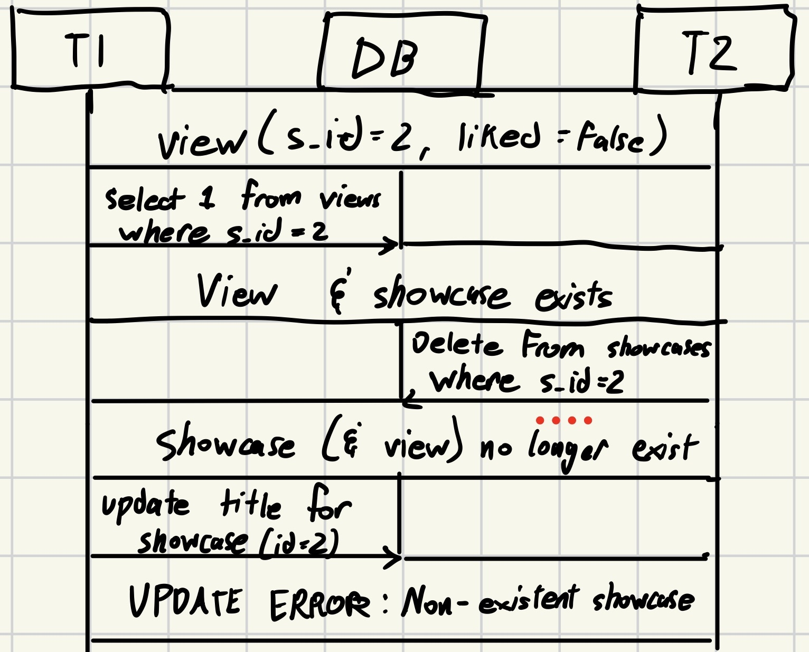

# Case 1: Updating Views (Lost Update)
Involved Endpoint(s):
- `POST /showcases/view/{showcase_id}`

Our current implementation tracks views using a ledger-based table that is functionally append-only. This is an update from the old way we managed views per showcase, which tracked a showcase's view as a value in the `showcases` table. This update helped prevents one user from inflating a showcase's view count. This ledger-based design also combats Lost Updates, for contexts in which multiple users are concurrently liking the same showcase. Had we stuck with our old design, we would have virtually dismissed concurrent views. 

### Flow diagram:

# Case 2: Liking a Deleted Showcase (Non-Repeatable Read)

Involved Endpoint(s):
- `PUT /showcases/like/{showcase_id}`
- `DELETE /showcases/{showcase_id}`

Currently, our like_showcase() endpoint postpones checking if the provided IDs (showcase and user) exist before updating the `liked` status in appropriate row within the `customer_views` table. The code then catches any error that would come as a result of a missing id, handling it afterward. If we had instead just simply read the values for their existence beforehand to check, and then update the `liked` status afterward, we run the risk of a non-repeatable read occuring if, for example, the showcase was deleted between the two operations.

### Flow diagram

# Case 3: More Likes than Views Trending (Read Skew)
Involved Endpoint(s):
- `GET /user/trending`
- `DELETE /showcases/{showcase_id}`

In our current implementation, the get_trending_users() endpoint utilizes multiples Common Table Expressions (CTEs) to make the query more atomic. These CTEs represent the gathering of a bunch of different, related data that are used to form the final query. This helps prevent read skews, as all this data is snapshotted from the beginning of the transaction. If we had instead utilized multiple smaller reads, for example turning `view_data`, `avg_views`, and `total_likes` into their own SELECT queries and had them ordered a bit different (getting likes first), we could have left room for a read skew. If there were concurrent transactions that deleted multiple showcases after getting `total_likes` but before finishing the rest of the transaction, it is possible that our final query returned data with an inflated number of likes relative to views. This data would be logically inconsistent.

### Flow diagram

